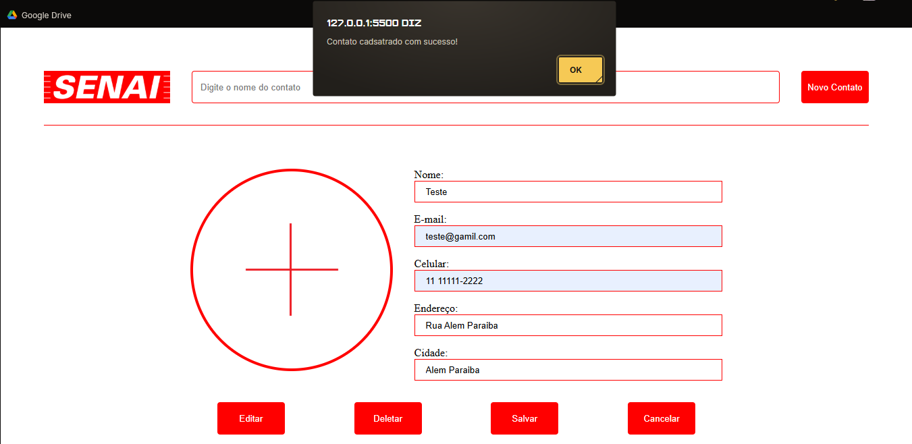
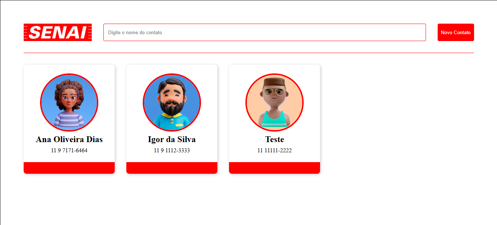

# Verbos http
Projeto Projeto criado para o aprendizado dos verbos http no FrontEnd

## Preview
#### Cadastrando Contato

#### Contato Cadastrado

## Funcionalidades

- Cadastrar novo contato

- Listar todos os contatos

- Editar um contato existente

- Excluir um contato

## Tecnologias utilizadas

- HTML5
- CSS3
- JavaScrip
- API-contatos

## Autor
[Guilherme Moreira](https://www.linkedin.com/in/guilherme-moreira-08a8b8348/)